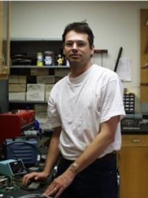
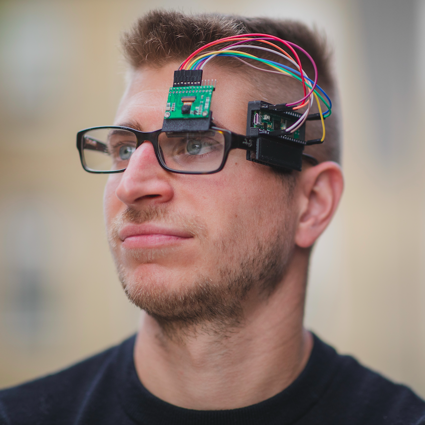
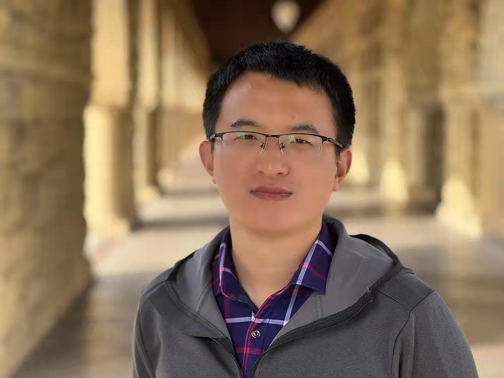
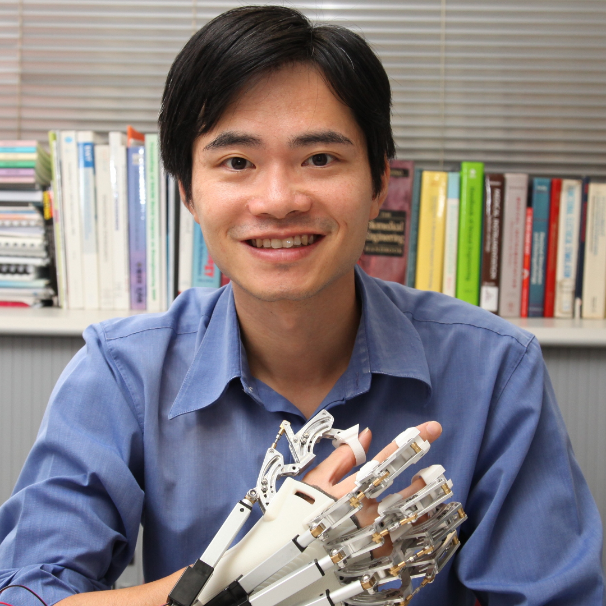
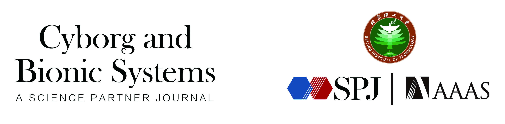

---
# Feel free to add content and custom Front Matter to this file.
# To modify the layout, see https://jekyllrb.com/docs/themes/#overriding-theme-defaults

permalink: /
title: "1st Workshop on Wearable Intelligence for Healthcare Robotics (WIHR): from Brain Activity to Body Movement"
list_title: Home
layout: home
---

<a href="https://2024.ieee-icra.org/">2024 IEEE International Conference on Robotics and Automation in PACIFICO Yokohama, Japan</a>

May 17th, 2024. Location: <a href="https://maps.app.goo.gl/sRLmoKcE8mKDdGEs9">North G301</a>

<!-- 
Location: Sequoia 1
 -->

<!-- [<a href="">Youtube</a>] -->[<a href="https://discord.gg/yqjTtBmUJC">Discord</a>] [<a href="https://openreview.net/group?id=IEEE.org/2024/ICRA/Workshop/WIHR">OpenReview</a>]

<!-- 
Recording available at: <a href="">Youtube</a>
 -->

The integration of artificial intelligence, wearable technologies, and robotics signifies a paradigm shift in healthcare, ushering in an era of personalized and pervasive digital health solutions. This pivotal intersection seamlessly melds real-time data acquisition, cutting-edge analytics, and precision-driven robotic interventions, together reshaping the very fabric of patient care. A spectrum of sensing modalities, from intricate brain-machine interfaces to dynamic muscle-machine interactions and advanced vision-based signals, offers a holistic understanding of the physiological and biomechanical intricacies inherent to the human body. These profound insights not only demystify cognitive processes and potential neurological anomalies but also set the stage for proactive interventions, particularly in the realms of rehabilitation/assistive, social, as well as surgical robotics. This workshop endeavors to dissect the multifaceted nature of this symbiotic integration, illuminating challenges, innovations, and the vast potential of a healthcare domain enriched by wearables and robotics. Our objective is to bridge the chasm between AI insights, wearable intelligence, and robotic precision, envisioning a healthcare future that’s seamlessly attuned to individual needs.

Driven by these observations and reflections, our workshop stands at the forefront of healthcare innovation. It will delve into several interconnected domains, each providing distinct perspectives and strategies to revolutionize the field of healthcare robotics.

We aim to discuss questions including, but not limited to:

- **Paradigms**: What new paradigms are being explored to develop innovative wearable solutions in healthcare robotics?
- **Algorithms**: What recent breakthroughs in AI have enhanced the capabilities of wearable intelligence in healthcare?
- **Data-Driven Approaches**: What are the most effective practices for learning from real-world and simulated data in healthcare robotics?
- **Efficient Learning**: How can we optimize the process of collecting and learning from real-world data in healthcare robotics?
- **Adaptability**: How can the design of healthcare wearable robotics be evolved to offer greater personalization and adaptability?
- **Interdisciplinary Integration**: How can cognitive science, neuroscience, and genetics be integrated to advance wearable intelligence and healthcare robotics?
- **Foundation Models**: What role can foundation models play in supporting wearable intelligence and healthcare robotics?
- **Human-Robot Interaction**: How can human-robot interaction be enhanced to improve patient comfort and trust in healthcare settings?
- **Applications**: How can AI and machine learning be leveraged in robotics for predictive healthcare and early diagnosis?
- **Ethics, Privacy, and Safety**: How can ethical considerations, patient privacy, and safety be prioritized in the development and implementation of wearable intelligence and healthcare robotics?
- **Future Prospects and Challenges**: What does the future hold for the use of wearable intelligence and robots in healthcare, and what are the associated challenges?

&nbsp;
&nbsp;

### Call for papers

We invite submissions including but not limited to the following topics:

- Cutting-edge wearable sensory technologies for healthcare robotics.
- Principles of human-centered design in healthcare wearable robotics.
- Integration of the Internet of Things (IoT) in healthcare wearable robotics.
- Fusion of multi-modal sensing technologies for wearable intelligence and healthcare robots.
- AI-based analysis of human movement.
- AI-based assessment of cognitive states.
- AI-based prediction of human intentions.
- AI-driven approaches in human-robot interaction.
- Personalized adaptive strategies for robotic interventions and assistance.
- Personalized monitoring of wearable devices.
- Monitoring system for intelligent cockpit.
- Tailored adaptive strategies for rehabilitation training.
- Customized strategies for real-time human-robot interaction.
- Data-driven learning approaches to address variations in individuals or subpopulations.
- Adaptive control policies for individual or subpopulation variances.
- Incorporating cognitive science, neuroscience, and genetics to enhance healthcare robotics.
- Ethics, privacy, and safety of wearable intelligence and healthcare robotics
- Emerging AR/VR/MR technologies for wearable intelligence and healthcare robotics
- LLM-based Agents for wearable intelligence and healthcare robotics
- Novel datasets and benchmarks for advancing wearable intelligence and healthcare robotics
- Future and challenges of wearable intelligence for healthcare robotics

**Important Dates**
- **Paper submission open**: 2024/01/01

- **Paper submission deadline**: 2024/04/03 PST

- **Notification of acceptance**: 2024/04/07

- **Camera ready**: 2024/05/03

- **Workshop date**: 2024/05/17

- **Submission portal**: [ICRA 2024 Workshop WIHR (OpenReview)](https://openreview.net/group?id=IEEE.org/2024/ICRA/Workshop/WIHR).

We expect submissions with 2 - 8 pages for the main content, with no limit on references/appendices. Submissions are suggested to use the [IEEE template](https://ras.papercept.net/conferences/support/support.php). All papers will be peer-reviewed in a double-blind manner. We welcome both unpublished original contributions and recently published relevant works. Accepted papers will be presented in the form of posters, with several papers being selected for spotlight sessions. The <b>Best Presentation Award</b> and <b>Best Poster Award</b> will be presented to honor exceptional contributions among the accepted submissions, with a cash prize of <b>300 US dollors</b> for each award.

NEWS: Excellent works are invited to submit an extended version to the special issue on SPJ Cyborg and Bionic Systems: [Emerging Trends in Wearable Technologies, AI, and Robotics for Pervasive Healthcare](https://spj.science.org/page/cbsystems/si/emerging-trends-in-wearable-technologies-ai-and-robotics-for-pervasive-healthcare) 

**Contact**

If you have any questions, please contact us at: wearable-intelligence@googlegroups.com.

&nbsp;
&nbsp;
### Invited Speakers
&nbsp;

    

        <figure>
        
        <figcaption><b><a href="https://scholar.google.com/citations?user=XC8CHRMAAAAJ&hl=en">Zijian Wang</a></b> Meta</figcaption>
        </figure>
    

    

        <figure>
         
        <figcaption><b><a href="https://www.mit.edu/~yuzhe/">Yuzhe Yang</a></b> MIT</figcaption>
        </figure>
    

    

        <figure>
        
        <figcaption><b><a href="https://www.imperial.ac.uk/people/george.mylonas">George Mylonas</a></b> Imperial College London</figcaption>
        </figure>
    

    

        <figure>
        
        <figcaption><b><a href="https://www.imperial.ac.uk/people/e.burdet">Etienne Burdet</a></b> Imperial College London</figcaption>
        </figure>
    

    

        <figure>
        
        <figcaption><b><a href="https://profiles.stanford.edu/jasmin-e-palmer">Jasmin E. Palmer
</a></b> Stanford University</figcaption>
        </figure>
    

    

        <figure>
        
        <figcaption><b><a href="https://kite-uhn.com/scientist/brokoslaw-laschowski">Brokoslaw Laschowski</a></b> Toronto Rehabilitation Institute & University of Toronto</figcaption>
        </figure>
    

    

        <figure>
        
        <figcaption><b><a href="https://scholar.google.com/citations?user=4uU8UXAAAAAJ&hl=en">Jinsoo Kim</a></b> Seoul National University</figcaption>
        </figure>
    

    

        <figure>
        
        <figcaption><b><a href="https://ai.stanford.edu/~zharu/">Ruohan Zhang</a></b> Stanford University</figcaption>
        </figure>
    

    <!-- 

        <figure>
        
        <figcaption><b><a href="https://profiles.stanford.edu/daniel-yamins">Daniel Yamins</a></b> Stanford University</figcaption>
        </figure>
    
 -->
    <!-- 

        <figure>
        
        <figcaption><b><a href="https://profiles.ucr.edu/app/home/profile/guoyuanw">Guoyuan Wu</a></b> UC Riverside</figcaption>
        </figure>
    
 -->

&nbsp;

### Organizers
&nbsp;

    

        <figure>
        
        <figcaption><b><a href="https://web.stanford.edu/~jksun">Jiankai Sun</a></b> Stanford University</figcaption>
        </figure>
    

    

        <figure>
         
        <figcaption><b><a href="https://xiaogu.site/">Xiao Gu</a></b> University of Oxford</figcaption>
        </figure>
    

    

        <figure>
        
        <figcaption><b><a href="https://yyueluo.com/">Yiyue Luo</a></b> MIT</figcaption>
        </figure>
    

    

        <figure>
        
        <figcaption><b><a href="https://scholar.google.com/citations?user=ETgWwQoAAAAJ&hl=en&oi=ao">Jianing Qiu</a></b> CUHK</figcaption>
        </figure>
    

    

        <figure>
        
        <figcaption><b><a href="https://scholar.google.com/citations?user=zcpunN8AAAAJ&hl=en">Shuo Jiang</a></b> Tongji University</figcaption>
        </figure>
    

    

        <figure>
        
        <figcaption><b><a href="https://scholar.google.com.sg/citations?user=3A_h6-sAAAAJ&hl=en">Wu Yuan</a></b> CUHK</figcaption>
        </figure>
    

    

        <figure>
        
        <figcaption><b><a href="https://www.port.ac.uk/about-us/structure-and-governance/our-people/our-staff/honghai-liu">Honghai Liu</a></b> University of Portsmouth</figcaption>
        </figure>
    

    

        <figure>
        
        <figcaption><b><a href="https://profiles.stanford.edu/steven-collins">Steven Collins</a></b> Stanford University</figcaption>
        </figure>
    

    

        <figure>
        
        <figcaption><b><a href="https://web.stanford.edu/~schwager/">Mac Schwager</a></b> Stanford University</figcaption>
        </figure>
    

    

        <figure>
        
        <figcaption><b><a href="https://www.imperial.ac.uk/people/benny.lo">Benny Lo</a></b> Imperial College London</figcaption>
        </figure>
    

### Scientific Advisory Board
&nbsp;

    

        <figure>
        
        <figcaption><b><a href="https://profiles.stanford.edu/lei-xing">Lei Xing</a></b> Stanford University</figcaption>
        </figure>
    

    

        <figure>
        
        <figcaption><b><a href="https://seas.harvard.edu/person/patrick-slade">Patrick Slade</a></b> Harvard University</figcaption>
        </figure>
    

    

        <figure>
        
        <figcaption><b><a href="https://www.eas.caltech.edu/people/weigao">Wei Gao</a></b> Caltech</figcaption>
        </figure>
    

    

        <figure>
        
        <figcaption><b><a href="https://www.mccormick.northwestern.edu/research-faculty/directory/profiles/rogers-john.html">John A. Rogers</a></b> Northwestern University</figcaption>
        </figure>
    

    

        <figure>
        
        <figcaption><b><a href="https://www.cse.cuhk.edu.hk/~pheng/">Pheng Ann Heng</a></b> CUHK</figcaption>
        </figure>
    

    

        <figure>
        
        <figcaption><b><a href="https://www.cs.unc.edu/~zlj/">Liang-Jun Zhang</a></b> Baidu</figcaption>
        </figure>
    

    

        <figure>
        
        <figcaption><b><a href="https://www.wearablesystems.org/people#/peter-shull">Peter Shull</a></b> Shanghai Jiao Tong University</figcaption>
        </figure>
    

    

        <figure>
        
        <figcaption><b><a href="https://www.imperial.ac.uk/people/e.yeatman">Eric Yeatman</a></b> Imperial College London</figcaption>
        </figure>
    

    

        <figure>
        
        <figcaption><b><a href="http://www.bme.cuhk.edu.hk/kytong/">Raymond Tong</a></b> CUHK</figcaption>
        </figure>
    

    

        <figure>
        
        <figcaption><b><a href="https://eng.ox.ac.uk/people/david-clifton/">David Clifton</a></b> University of Oxford</figcaption>
        </figure>
    

    

        <figure>
        
        <figcaption><b><a href="https://med.stanford.edu/profiles/david-camarillo">David Camarillo</a></b> Stanford University</figcaption>
        </figure>
    

    

        <figure>
        
        <figcaption><b><a href="https://people.seas.harvard.edu/~samurphy/">Susan A. Murphy</a></b> Harvard University</figcaption>
        </figure>
    

    

        <figure>
        
        <figcaption><b><a href="https://nmbl.stanford.edu/people/scott-delp/">Scott L. Delp</a></b> Stanford University</figcaption>
        </figure>
    

    

        <figure>
        
        <figcaption><b><a href="https://biodesign.seas.harvard.edu/conor-walsh">Conor Walsh</a></b> Harvard University</figcaption>
        </figure>
    

&nbsp;

### Program Committee
&nbsp;

    

        

&#8226;&nbsp;<a href="https://zipingxu.github.io/">Ziping Xu</a> (Harvard)

        

&#8226;&nbsp;<a href="https://schmidtsciencefellows.org/fellow/asim-gazi/">Asim Gazi</a> (Harvard)

        

&#8226;&nbsp;<a href="https://treelli.github.io/">Lin Li</a> (KCL)

        

&#8226;&nbsp;<a href="https://www.gla.ac.uk/schools/computing/staff/fanideligianni/">Fani Deligianni</a> (UofG)

         

&#8226;&nbsp;<a href="https://scholar.google.com/citations?user=mabc04YAAAAJ&hl=en">Kyle Lam</a> (Imperial)

        

&#8226;&nbsp;<a href="https://www.researchgate.net/scientific-contributions/Zeyu-Wang-2216092052">Zeyu Wang</a> (Imperial)

    

    

        

&#8226;&nbsp;<a href="https://anyirao.com/">Anyi Rao</a> (Stanford)

        

&#8226;&nbsp;<a href="https://jiaqixuac.github.io/">Jiaqi Xu</a> (CUHK)

        

&#8226;&nbsp;<a href="https://scholar.google.com/citations?user=LXwEufAAAAAJ&hl=en&oi=ao">Chuheng Wei</a> (UC Riverside)

        

&#8226;&nbsp;<a href="https://uk.linkedin.com/in/nlkaur">Narinder Kaur</a> (UofG)

        

&#8226;&nbsp;<a href="">Shuai Jiang</a> (Sun Yat-sen University)

        

&#8226;&nbsp;<a href="https://ieeexplore.ieee.org/author/37086579788">Lipeng Chen</a> (Tencent Robotics X)

    

    

        

&#8226;&nbsp;<a href="https://scholar.google.co.uk/citations?user=lLHEIC4AAAAJ&hl=en">Frank P. -W. Lo</a> (Imperial)

        

&#8226;&nbsp;<a href="https://scholar.google.co.uk/citations?user=sLRZCxMAAAAJ&hl=en">Yingnan Sun</a> (OPPO)

        

&#8226;&nbsp;<a href="https://scholar.google.com/citations?user=JW4F5HoAAAAJ&hl=zh-CN">Haibao Yu</a> (HKU)

        

&#8226;&nbsp;<a href="https://scholar.google.com/citations?user=rHHZrQEAAAAJ&hl=zh-CN">Bo Xiao</a> (Imperial)

        

&#8226;&nbsp;<a href="https://scholar.google.com/citations?user=WFxAYYQAAAAJ&hl=en">Lei Lu</a> (KCL)

    

### Sponsors
&nbsp;

    

        <figure>
        
        <!-- <figcaption><b><a href="https://www.intel.com/">Intel</a></b> </figcaption> -->
        </figure>
    

    

        <figure>
        
        <!-- <figcaption><b><a href="https://gdp.rjmart.cn">Guangzhou Coloring Technology Co., Ltd.</a></b> </figcaption> -->
        </figure>
    

    

        <figure>
        
        <!-- <figcaption><b><a href="https://gdp.rjmart.cn">Guangzhou Coloring Technology Co., Ltd.</a></b> </figcaption> -->
        </figure>
    

